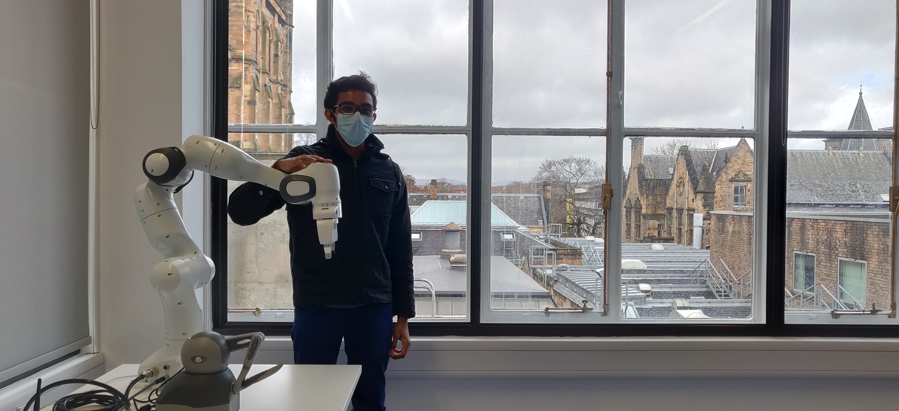

# Robothon-2021-Digital-Application
We believe Robothon is a great opportunity for us to showcase our passion in Robotics by solving a challenging problem of E waste management using Robotics. We believe as engineers and researchers, its our responsibility to solve hard problems in our society to make the human existance more sustainable, by protecting our planet earth from the overuse of limited resources. This challenge will expose us to hard problems in the society that can be solved using robotics,  improve our critical thinking and collaborative thinking skills as well as presentation and networking skills. Thankyou for this great opportunity.

As suggested in the application, please find the link to the CV of both of us.

*Shivoh Chirayil Nandakumar* -[CV](CV_March.pdf)
*Liyuan Qi* - [CV](CV.pdf)

## Robot system

We have a Franka Emika Panda Robotic Arm for our research work at University of Glasgow, UK. If required, we will be using various end effectors and vision system for the successful completion of this competition.
Shivoh has experience in developing **ROS** nodes and mapping algorithm for the teleoperation of **Franka Robotic Arm** utilising parameters of the **Opti track 3-D motion tracking** systems.
He has good exposure in integrating vision system for the **object and color detection and manipulation of the objects** using Dobot Magician Robotic Arm. Further, he has integrated and tested the **YOLO deep learning model** utilising the camera system of Pepper Humaniod Robot.
Liyuan has participated in several Computer-vision based projects. In his third year of undergraduate,he worked as a image-processing programmer in a line patrol robot project in which he developed a algorithm to distinguish a path from a complicated background by using **OpenCV**. During his first year of PhD, he helped to build up a **hand gesture recognition system(based on computer vision)** which is a component of a tele-operation and **manipulation system** for the Softbank Humanoid Robot Pepper. 
 We are passionate about robotics and loves to solve challenging problems. Eagerly Looking forward to the Robothon 2021 and excited to solve the grand challenges.

